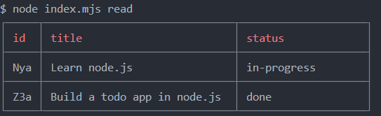
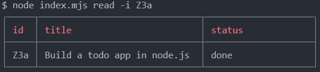

# Node.js CLI-based TASK MANAGER APP

Clone this repository: 
```Bash
https://github.com/cod3simplified/nodejs-todo-cli
```

Navigate to the project directory:
```Bash
cd nodejs-todo-cli
```

## Add a Todo
Use the `add` command, pass `-t` or `--title` for the title and `-s` or `--status`, for the status, status can either be `todo` or `in-progress` or `done`.
```Bash
node index.mjs add -t "Learn node.js" -s "in-progress"
```

```Bash
node index.mjs add --title "Build a todo app in node.js" -s "done"
```

## Read todos / todo
You can list all todos using the `read` command.



You can read a specific todo, use the `-i` or `--id` flag to specify the id of that todo.



## Update a todo
Update a todo using the `update` command, pass the id of this todo using the `-i` or `--id` and then pass either the new title using `-t` or `--title` or status using the `-s` or `--status` or both.

```Bash
node index.mjs update -i Nya --title "Learn NODE.js because it is fun"
```

## Delete todo
Delete a todo using the delete command, simply pass the id of the todo using the `-i` or `--id` flag.
```Bash
node index.mjs delete -i Nya
```

## filter
You can filter the todos by status, i.e., get all that are 'in-progress', 'todo', 'done'. Use the `filter` command and pass the status using `-s` or `--status` flag.
```Bash
node index.mjs filter -s "done"
```